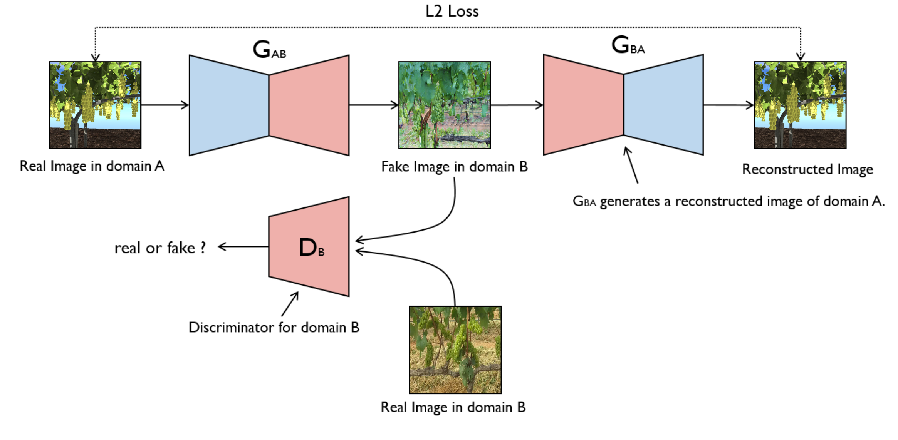

# Generative AI for Grapes Detection in Agritech: A Synthetic Image Augmentation Pipeline




## Authors
University of Naples Federico II, Department of Mathematics and Applications ``R. Caccioppoli", Mathematical mOdelling and Data AnaLysis (M.O.D.A.L.) research group.


## Data Availability
The data used in this project comes from the **WGISD Dataset** [Link to the repository](https://github.com/thsant/wgisd)(Wine Grape Image Segmentation Dataset). We would like to thank the creators and researchers who made this dataset available, as it significantly contributed to the development of this work.


## Requirements

### Generation & Classification  
To set up the environment for image generation and classification, create a python environment using the provided `cycle_yolo.yml` file:  
```sh
conda env create -f cycle_yolo.yml
conda activate cycle_yolo
```


## Execution Instructions

## 1. Generation

### Prepare Data**
We provide our data in the folder `$your_folder/Dataset_CycleGAN/created_dataset` as an example, you can prepare your own dataset following this format. 

### **Source domain (domain A) data**
Synthethic images, generated with Helios (you can use any domain data, even its not synthetically generated).  

### **Target domain (domain B) data**
Real images, obtained by WGSID (you can use any real data).

### **Data organization**
Data used to train CycleGAN
```bash
Dataset_CyleGAN
└── created_dataset
    ├── trainA # (domain A images)
    └── trainB # (domain B images)
```
To begin training the CycleGAN model, navigate to the `CycleGAN` directory by running:

```sh
cd $your_folder/CycleGAN

```
Then, run the following command to start the training process:

```sh
python train.py --dataroot $your_folder/Dataset_CycleGAN/created_dataset\
             --num_threads 10\
             --name Grapes\
             --dataset_mode unaligned\
             --checkpoints_dir $your_folder/CycleGAN/model_saves\
             --model cycle_gan\
             --load_size 640\
             --crop_size 416\
             --batch_size 3\
             --preprocess resize_and_crop\
             --gpu_ids 0\
             --n_epochs 100\
             --n_epochs_decay 100\
             --save_epoch_freq 100
```
Feel free to modify these values based on your hardware or specific requirements for the project.

## 2. Classification
## Prepare Data**
We provide our data in the folder "$your_folder/Dataset_YOLO/wgisd" as an example, you can prepare your own dataset following this format. 

### **Data organization**
Data used to train YOLO
```bash
Dataset_YOLO
└── wgisd
    ├── train
        ├── images
        └── labels
    ├── val
        ├── images
        └── labels
    └── test
        ├── images
        └── labels
```
To begin training the  model, run the following command to start the training process:
```sh
python yolo_train.py --train True\
            --dataset wgisd\
            --batch_size 32\
            --device 0\
            --epochs 300
```
Feel free to modify these values based on your hardware or specific requirements for the project.

## References

- **CycleGAN**: *Zhu et al.* (2017) [Link to the paper](https://arxiv.org/abs/1703.10593)

- **CropGAN**: *Zhenghao Fei et al.* (2021) [Link to the paper](https://arxiv.org/abs/2108.13344)

- **Helios Platform**: [Link to the platform](https://baileylab.ucdavis.edu/software/helios/)
